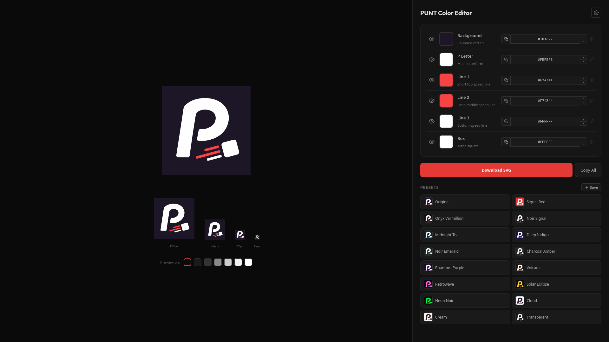

# SVG Palette Editor (SPE)

A standalone, zero-dependency SVG color editor with real-time preview. Edit individual SVG element colors with a full color picker, link layers to sync colors, toggle visibility, and export clean SVGs — all from a single HTML file.



## Features

### Color Editing
- **Per-element color control** — independent picker for each SVG path/shape
- **Full color picker** — saturation/value square, hue bar, opacity slider
- **Format switching** — cycle between hex, rgba, and hsla with inline up/down arrows
- **Live input** — type values directly, updates in real-time (no Enter required)
- **Arrow key adjustment** — place cursor on any number and Up/Down to nudge (Shift for 10x, 0.01 step for alpha)
- **Transparent support** — per-element transparency with checkerboard preview
- **Copy per field** — one-click copy in the active format
- **Invalid fallback** — bad input resets to black with a toast

### Layer Management
- **Visibility toggles** — eye icon to show/hide individual elements
- **Layer linking** — click a chain icon, then click other layers to sync their colors. Edit one, all update
- **Multi-link chaining** — stay in linking mode to chain A → B → C. Multiple independent groups with colored indicators
- **Unlink** — click self to remove from group, or click a linked layer to detach it
- **Hover highlighting** — hover a control to glow the target SVG element and dim others. Linked layers highlight together
- **Editable labels** — rename layer names and descriptions inline

### Presets
- **16 built-in presets** with mini icon previews
- **Save current colors** as a new preset with one click
- **Rename** — click a user preset name to edit inline
- **Delete** — X button with toast confirmation
- **Persistent** — user presets saved to localStorage across sessions

### Preview & Export
- **Multi-size preview** — 280, 128, 64, 32, and 16px simultaneously
- **Preview backgrounds** — test against 7 surfaces from black to white
- **SVG download** — clean SVG with current colors and visibility state
- **Copy All** — copies all values in their per-field format (hex/rgba/hsla)

## Usage

Open `index.html` in a browser. No build step, no install, no server.

```bash
git clone https://github.com/jmynes/svg-palette-editor.git
open svg-palette-editor/index.html
```

## Customizing for your own SVG

The editor is configured for the [PUNT](https://github.com/jmynes/punt) project icon. To adapt it:

1. Extract your SVG paths into the `PATHS` object
2. Rename and update the icon component with your paths
3. Adjust the `viewBox` to match your SVG
4. Update `DEFAULT_PRESETS` with color themes for your design
5. Add or remove layer entries in the App component to match your element count

## Tech

Single HTML file using:
- React 18 (CDN)
- Babel standalone (CDN, for JSX)
- No other dependencies

Color conversion (hex ↔ HSV ↔ RGBA ↔ HSLA), the picker UI, drag handling, layer linking, and preset persistence are all built from scratch.

## License

MIT
